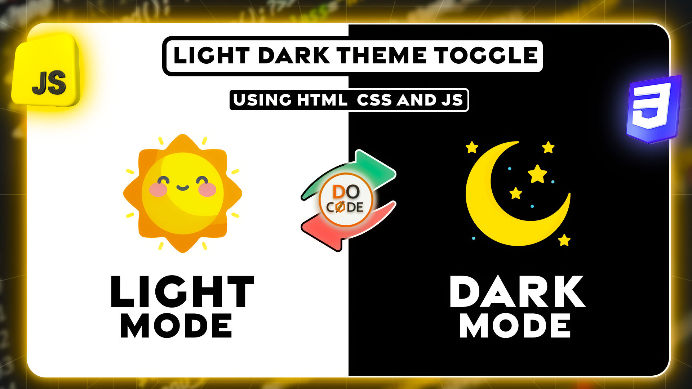
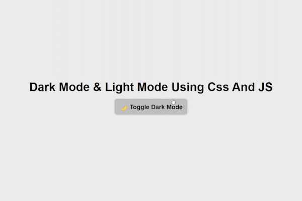

# Dark Mode & Light Mode Using CSS and JavaScript



This project demonstrates a simple implementation of a **Dark Mode & Light Mode** toggle using **CSS and JavaScript**. It allows users to switch between themes, and the selection is stored in **localStorage** to persist across sessions.
## 🔥 Preview


## 🔥 Tutorials
📺 Watch the tutorial on **[Video Tutorial](##)**


📖 Read the blog post on **[Blog Tutorial](https://docode.co.in/post/dark-mode-light-mode-toggle-css-js)**

---
## 🚀 Features

✅ **Simple & Lightweight** – No external libraries required

✅ **Smooth Theme Transition** – Uses CSS variables for easy customization

✅ **Local Storage Support** – Remembers the user's preference

✅ **Responsive Design** – Works on all screen sizes

---

## 📂 Project Structure
```
📂 dark-mode-toggle

├── index.html # Main HTML file with theme toggle button

├── README.md # Project documentation

```
---

## 🛠️ How to Use

1.  **Clone the Repository**

```sh

git clone https://github.com/docode537/theme-toggler-using-css-and-js.git
```
2.  **Open `index.html` in a browser**

3.  **Click the Toggle Button** to switch between Light and Dark mode 🎨

4.  **The selected mode is saved** and remains after refreshing the page 🔄

---

## 🌟 How It Works

- The `data-theme` attribute on the `<body>` element controls the theme.

- CSS variables (`:root`) define colors for **Light Mode** and **Dark Mode**.

- JavaScript listens for button clicks and switches themes accordingly.

-  **LocalStorage** saves the selected theme, so it persists across sessions.

---

## 💡 Code Snippet

```html

<body  data-theme="light">

<h1>Dark Mode & Light Mode Using CSS and JS</h1>

<button  class="themeToggler">🌙 Toggle Dark Mode</button>

</body>

```
```js

const  themeToggler = document.querySelector('.themeToggler');

const  body = document.body;

function  initTheme() {

body.setAttribute('data-theme', localStorage.getItem('theme') || 'light');

}

function  toggleTheme() {

let  currentTheme = body.getAttribute('data-theme');

let  nextTheme = currentTheme === 'light' ? 'dark' : 'light';

localStorage.setItem('theme', nextTheme);

body.setAttribute('data-theme', nextTheme);

}
themeToggler.addEventListener('click', toggleTheme);

initTheme();

```
---

## 🏗️ Customization

Want to customize the theme colors? Edit the CSS variables in the `<style>` section of `index.html`:

```css

:root {

--bg: #ececec;

--text: black;

--primaryBg: #c0c0c0;

--primaryText: #1b1b1b;

}

body[data-theme="dark"] {

--bg: #121212;

--text: #ffffff;

--primaryBg: #222;

}

```

---
📢 **Feel free to fork, modify, and use it in your projects!**

---

## 📬 Connect With Me

📧 Email: docode537@gmail.com

🌍 Website: [docoe.co.in](https://docode.co.in/)

📷 Youtube: [@docode537](https://www.youtube.com/@docode537)

Don't forget to ⭐ the repo if you like it! 🚀
